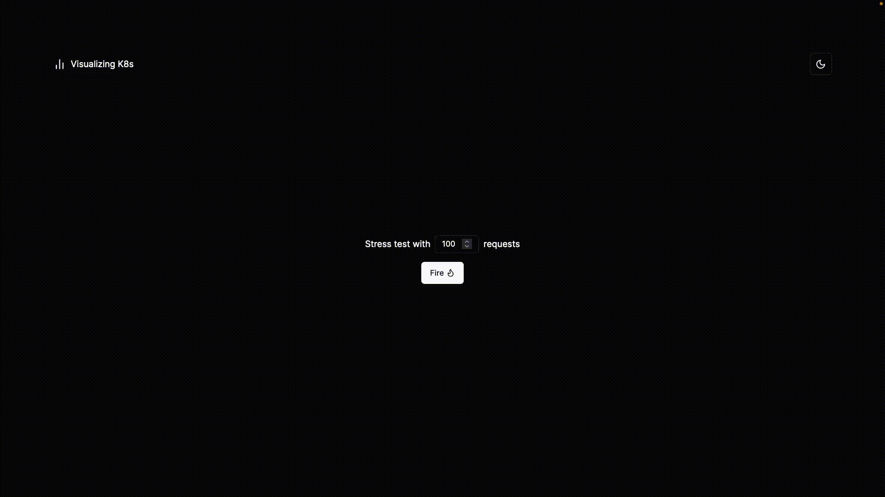

<div align="center">
    
</div>

# Visualizing K8s

Testing concurrency with Kubernetes based on a stress test application.

---

## 🖥️ Tech Stack∂

[](https://skillicons.dev)

---

## ▶️ Getting Started

#### On server

1. **Create the Kubernetes cluster using K3s for example**
2. **Deploy the application using the following command**: `kubectl apply -f deployment.yaml`
3. **Create the load balancer service**: `kubectl apply -f service.yaml`
4. **Run the single container application**:
   `docker run -d -p 8000:8080 --restart unless-stopped --cpus="0.2" --name requesting-k8s lordjoaosouza/requesting-k8s:latest`

#### Locally

1. **Run the local applications listed on docker-compose file**: `docker compose up -d`

After that, you can access the front-end application on `http://localhost:3000` and the test API
on `http://localhost:8080`.
Also, the single container application can be accessed on `<SERVER-IP>:8000` and the Kubernetes load balancer service
on `<SERVER-IP>:8080` (when requesting to load balancer service, the requests will be distributed between the pods).

---

## 📍 API Endpoints

The endpoints follow this structure, where ``PRECISION`` is the precision for the Pi calculation,
and ``QUANTITY`` is the number of threads that will be launched to call the API:

```yaml
{
  "ip": "<SERVER-IP>:<PORT>/picalc/<PRECISION>",
  "quantity": <QUANTIYY>
}
```

### POST / Boot Stress Test

<kbd>POST /http://localhost:8080/picalc/testapi</kbd>

### Example Single container endpoint:

**REQUEST**

```json
{
  "ip": "<SERVER-IP>:8000/picalc/1000000",
  "quantity": 1000
}
```

**RESPONSE**

```json
{
  "success": true,
  "message": null,
  "data": {
    "timeInMilliseconds": 36172,
    "hits": 961,
    "fails": 39
  }
}
```

### Example cluster endpoint:

**REQUEST**

```json
{
  "ip": "<SERVER-IP>:8080/picalc/1000000",
  "quantity": 1000
}
```

**RESPONSE**

```json
{
  "success": true,
  "message": null,
  "data": {
    "timeInMilliseconds": 9021,
    "hits": 1000,
    "fails": 0
  }
}
```

---

## 🤝 Collaborators

<table>
  <tr>
    <td align="center">
      <a href="#">
        <br>
        <sub>
          <a href="https://github.com/Sarinho01">Alan Sarinho</a>
        </sub>
      </a>
    </td>
    <td align="center">
      <a href="#">
        <br>
        <sub>
          <a href="https://github.com/lordjoaosouza">João Souza</a>
        </sub>
      </a>
    </td>
    <td align="center">
      <a href="#">
        <br>
        <sub>
          <a href="https://github.com/raiisoares">Raí Soares</a>
        </sub>
      </a>
    </td>
  </tr>
</table>

---

## 📄 License

This software is available under the following licenses:

- [MIT](https://rem.mit-license.org)