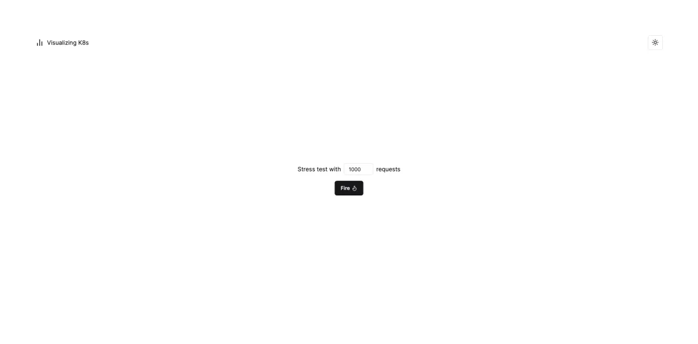
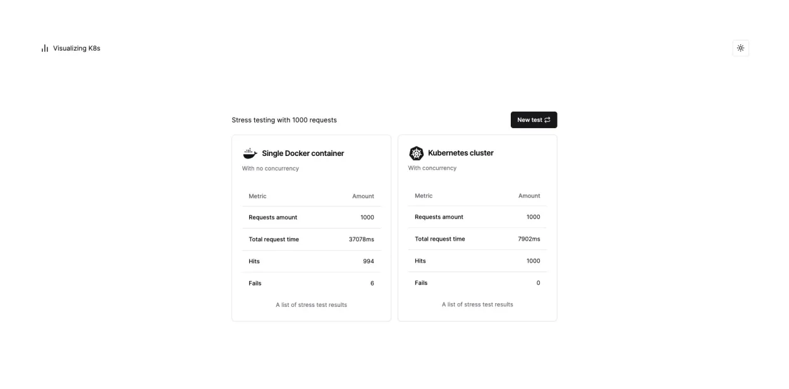
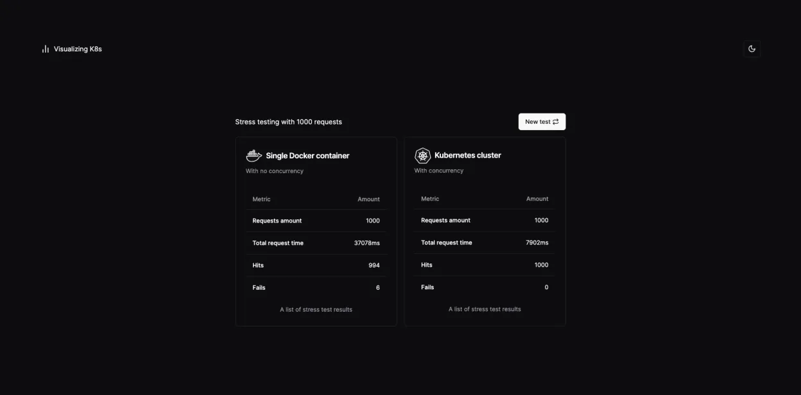

<p align="center">
    
    
</p>

<p align="center">
    
    
</p>

# Visualizing K8s

Testing concurrency with Kubernetes based on a stress test application.

## Tech Stack

[](https://skillicons.dev)

## Getting Started

1. **Install Dependencies**: `npm install or yarn`
2. **Create containers**: `docker-compose up -d`
3. **Environment variables**: Copy `.env.example` to a new `.env.local`
4. **Database Setup**: `npx prisma migrate dev --name init`
5. **Start Developing**: `npm run start:dev (api) & npm run dev (frontend)`

<h2 id="routes">📍 API Endpoints</h2>

The endpoints follow this structure, where ``precision`` is the precision for the Pi calculation,
and ``quantity`` is the number of threads that will be launched to call the API:

```json
{
  "ip": "<IP>:PORT/picalc/<precision>",
  "quantity": <quantity>
}
```

<h3 id="get-auth-detail">POST / Boot Stress Test</h3>
<kbd>POST /http://localhost:8080/picalc/testapi</kbd>

Example Single container endpoint:

**REQUEST**
```json
{
  "ip": "<container-ip>:8000/picalc/1000000",
  "quantity": 1000
}
```

**RESPONSE**
```json
{
  "success": true,
  "message": null,
  "data": {
    "timeInMilliseconds": 36172,
    "hits": 961,
    "fails": 39
  }
}
```

Example cluster endpoint:

**REQUEST**
```json
{
  "ip": "<cluster-ip>:8080/picalc/1000000",
  "quantity": 1000
}
```
**RESPONSE**
```json
{
  "success": true,
  "message": null,
  "data": {
    "timeInMilliseconds": 9021,
    "hits": 1000,
    "fails": 0
  }
}
```


<h2 id="colab">🤝 Collaborators</h2>
<table>
  <tr>
    <td align="center">
      <a href="#">
        <br>
        <sub>
          <a href="https://github.com/Sarinho01">Alan Sarinho</a>
        </sub>
      </a>
    </td>
    <td align="center">
      <a href="#">
        <br>
        <sub>
          <a href="https://github.com/lordjoaosouza">João Souza</a>
        </sub>
      </a>
    </td>
    <td align="center">
      <a href="#">
        <br>
        <sub>
          <a href="https://github.com/raiisoares">Raí Soares</a>
        </sub>
      </a>
    </td>
  </tr>
</table>

## License

This software is available under the following licenses:

- [MIT](https://rem.mit-license.org)